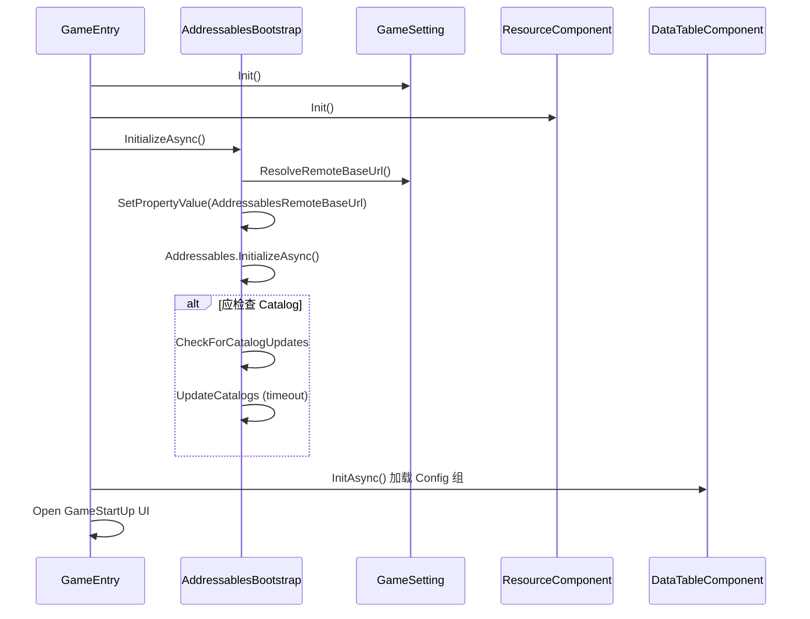

# Addressables 重配置设计

> 日期：2026-07-02  
> 状态：已确认  
> 模式：本地包打底 + 远程热更（C）  
> CDN：运行时可配置（B）  
> Catalog：启动检查 + 可配置开关（C）

## 1. 背景与目标

### 1.1 现状问题

- 所有运行时资源集中在单一 `Runtime Assets` 组，`Pack Together` 打成一个大 Bundle，无法按需加载。
- 空 `Entity` 组为 Default Group，与真实数据组不一致，造成配置冗余与混淆。
- `RuntimeAddressablesConfigurator` 同步范围不完整（遗漏 `UI/Item`、`RoguelikeMap` 等）。
- 场景已注册 Addressables，但 `SceneComponent` 仍使用 `SceneManager.LoadSceneAsync(完整路径)`，Player 构建后可能失败。
- `BuildRemoteCatalog = 0`，未建立远程热更能力。
- 存在 `Assets/AddressableAssetsData/` 与 `Assets/Scripts/Libraries/AddressableAssetsData/` 两套配置目录。

### 1.2 目标

1. **分类合理**：按运行时加载阶段拆分 Addressables Group，消除冗余组。
2. **不冗余**：Address 继续沿用 `Assets/...` 全路径，不改 `AssetsPathHelper` 与业务加载代码。
3. **离线可玩**：首包 Local 构建包含当前全部玩法资源，单人/Agent 测试不依赖 CDN。
4. **远程热更**：支持 Content Update 与远程 catalog，战斗/配表等内容可增量更新。
5. **CDN 可配置**：远程 Load Path 可在运行时由 `GameSetting` 或服务器下发覆盖。
6. **Catalog 可控**：默认启动时检查 catalog 更新；Agent 测试与开发环境可关闭。

### 1.3 非目标

- 不修改 `EntityViewSystem` 的 `assetsPath` 相对路径约定。
- 不引入 `Resources.Load` 回退。
- 不在本阶段实现完整 DLC 商店/UI（`Remote-DLC` 组仅预留结构）。
- 不修改帧同步协议与服务端。

---

## 2. 运行时加载契约（保持不变）

| Helper 方法 | Address 格式 | 主要调用方 |
|-------------|--------------|------------|
| `GameAssetsConfigHelper(name)` | `Assets/GameAssetConfig/{name}.asset` | `DataTableComponent`, `BaseWorld` |
| `LoadGameConfig(name)` | `Assets/Config/{name}.asset` | 地图配置 |
| `UIWindowPathHelper(name)` | `Assets/Prefabs/UI/Window/{name}.prefab` | `UIComponent` |
| `EntityPathHelper(relative)` | `Assets/Prefabs/Battle/{relative}.prefab` | `EntityViewSystem` |
| `NavMeshPathHelper(name)` | `Assets/Prefabs/NavMesh/{name}.prefab` | `NavMeshSystem` |
| `LoadMapCellPathHelper(name)` | `Assets/Prefabs/Map/MapCube/{name}.prefab` | 地图系统 |
| `LoadScenePathHelper(name)` | `Assets/Scene/{name}.unity` | `SceneComponent` |

`ResourceComponent.AsyncLoadAsset<T>(path)` 与 `Addressables.LoadAssetAsync<T>(path)` 的 `path` 即为上表 Address。

---

## 3. Group 设计

### 3.1 分组总览

| Group | 资产范围 | Bundle 策略 | Content Update |
|-------|----------|-------------|----------------|
| **Config** | `Assets/GameAssetConfig/**/*.asset`<br>`Assets/Config/**/*.asset` | Pack Together | Can Change |
| **UI** | `Assets/Prefabs/UI/**/*.prefab` | Pack Together | Can Change |
| **Scene-Core** | `Assets/Scene/Launcher.unity` | Pack Separately | Static |
| **Battle-Entity** | `Assets/Prefabs/Battle/Hero/**`<br>`Assets/Prefabs/Battle/Monster/**` | Pack Separately | Can Change |
| **Battle-Content** | `Assets/Prefabs/Battle/Skill/**`<br>`Effects/**` `State/**` `Bullet/**`<br>`DamageText/**` `Tree/**` | Pack Separately（按一级子目录） | Can Change |
| **Map** | `Assets/Prefabs/Map/**`<br>`Assets/Prefabs/RoguelikeMap/**`<br>`Assets/Prefabs/NavMesh/**` | Pack Together | Can Change |
| **Scene-Battle** | `Assets/Scene/` 下除 Launcher 外场景 | Pack Separately | Can Change |
| **Remote-DLC**（预留） | 手动标记的新增 DLC 资产 | Pack Separately | Can Change |

### 3.2 删除与合并

- **删除**空 `Entity` 组。
- **删除**单一 `Runtime Assets` 组（由上述分组替代）。
- **保留** `Built In Data` 系统组。
- **Default Group** 设为 `Config`。

### 3.3 Labels（可选，用于分析与后续 DLC）

| Label | 绑定 Group |
|-------|------------|
| `config` | Config |
| `ui` | UI |
| `scene-core` | Scene-Core |
| `battle-entity` | Battle-Entity |
| `battle-content` | Battle-Content |
| `map` | Map |
| `scene-battle` | Scene-Battle |
| `remote-dlc` | Remote-DLC |

---

## 4. 本地 / 远程双通道（混合模式 C）

### 4.1 Profile 变量

在 Default Profile 中使用以下变量（名称与 Unity 默认保持一致）：

| 变量 | 构建用途 | 示例值 |
|------|----------|--------|
| `BuildTarget` | 平台 | `[UnityEditor.EditorUserBuildSettings.activeBuildTarget]` |
| `Local.BuildPath` | 首包 Bundle 输出 | `[UnityEngine.AddressableAssets.Addressables.BuildPath]/[BuildTarget]` |
| `Local.LoadPath` | 首包运行时加载 | `{UnityEngine.AddressableAssets.Addressables.RuntimePath}/[BuildTarget]` |
| `Remote.BuildPath` | 热更 Bundle 输出 | `ServerData/[BuildTarget]` |
| `Remote.LoadPath` | 远程运行时加载 | `{AddressablesRemoteBaseUrl}/[BuildTarget]` |

`AddressablesRemoteBaseUrl` 为**自定义运行时属性**（见第 5 节），Editor Profile 中可填占位默认值（如 `http://127.0.0.1:HostingPort`）仅供构建校验。

### 4.2 各 Group 的 Build/Load Path

| Group | Build Path | Load Path | 首包是否包含 |
|-------|------------|-----------|--------------|
| Config | Local | Local | 是 |
| UI | Local | Local | 是 |
| Scene-Core | Local | Local | 是 |
| Battle-Entity | Local | **Remote.LoadPath**（运行时回落 Local） | 是（Local 构建写入 StreamingAssets） |
| Battle-Content | Local | **Remote.LoadPath**（运行时回落 Local） | 是 |
| Map | Local | **Remote.LoadPath**（运行时回落 Local） | 是 |
| Scene-Battle | Local | **Remote.LoadPath**（运行时回落 Local） | 是 |
| Remote-DLC | Remote | Remote | 否 |

**说明：**

- **首包发布**：对所有 Group 执行 Full Build，Bundle 写入 `Local.BuildPath` 并随 Player 分发。
- **热更发布**：对 `Can Change` 的 Group 执行 *Update a Previous Build*，变更 Bundle 输出到 `Remote.BuildPath` 并上传 CDN。
- **Load Path 设为 Remote**：热更后客户端优先从 CDN 拉取新 Bundle；CDN 不可达时，Addressables 仍可使用首包内 Local 副本（需保证首包已包含基线资源）。

### 4.3 Addressables 设置项

| 设置 | 值 |
|------|-----|
| `BuildRemoteCatalog` | `true` |
| `BundleLocalCatalog` | `false`（远程 catalog 为主） |
| `DisableCatalogUpdateOnStart` | `false`（由应用层控制是否调用更新 API） |
| `m_NonRecursiveBuilding` | 保持 `1`；构建后执行 Analyze → Check Duplicate Bundle Dependencies |

---

## 5. CDN 运行时配置（方案 B）

### 5.1 配置来源与优先级

运行时解析 `AddressablesRemoteBaseUrl` 的优先级（高 → 低）：

1. **服务器下发**（联机登录/版本检查后写入，具体消息类型实施阶段再定，可先留接口）
2. **`GameSetting` 序列化字段**（Inspector 可配，便于开发/测试 CDN）
3. **`PlayerPrefs` 开发覆盖**（仅 Editor/Dev Build，键名如 `Addressables.RemoteBaseUrlOverride`）
4. **内置默认值**（如空字符串表示仅使用 Local，不尝试远程）

### 5.2 新增配置类型

在 `GameSettingComponent` 同目录新增 `AddressablesContentSettings`（`ScriptableObject` 或 `RunTimeComponent` 序列化字段）：

```csharp
// 字段示意
public string DefaultRemoteBaseUrl;           // 如 https://cdn.example.com/addressables
public bool EnableCatalogUpdateOnStartup;     // 默认 true
public bool ForceLocalOnly;                   // true 时跳过 catalog 检查与远程下载
public float CatalogUpdateTimeoutSeconds;     // 默认 10s，超时则用本地 catalog 继续
```

挂载在 `GameEntryRunTime` 的 `ResourceComponent` 或独立 `AddressablesBootstrapComponent` 上。

### 5.3 运行时注入

在 `Addressables.InitializeAsync()` **之前**：

```csharp
string remoteBase = ResolveRemoteBaseUrl();
if (!string.IsNullOrEmpty(remoteBase))
{
    AddressablesRuntimeProperties.SetPropertyValue("AddressablesRemoteBaseUrl", remoteBase.TrimEnd('/'));
}
```

Profile 中 `Remote.LoadPath` 模板为 `{AddressablesRemoteBaseUrl}/[BuildTarget]`，与注入属性对齐。

### 5.4 服务器下发接口（预留）

```csharp
public interface IAddressablesRemoteUrlProvider
{
    bool TryGetRemoteBaseUrl(out string baseUrl);
}
```

- 联机：可由 `FrameSyncClientComponent` 连接后接收版本/资源 URL 消息再刷新（本阶段可先实现空实现，仅走 `GameSetting` 默认值）。
- 单机：使用 `GameSetting` 默认 URL 或 `ForceLocalOnly`。

---

## 6. Catalog 更新策略（方案 C）

### 6.1 默认行为

在 `GameEntry.InitOptionalComponent()` 中，`DataTable.InitAsync()` **之前**插入：

```
AddressablesBootstrap.InitializeAsync()
  →（可选）应用 RemoteBaseUrl
  → Addressables.InitializeAsync()
  → 若应检查 catalog：CheckForCatalogUpdates → UpdateCatalogs → 记录结果日志
  → 继续 Resource / DataTable 初始化
```

### 6.2 跳过检查的条件（任一满足即跳过）

| 条件 | 原因 |
|------|------|
| `ResourceComponent.GameResourceMode != Addressables` | Editor 直读模式 |
| `AddressablesContentSettings.ForceLocalOnly == true` | 强制纯本地 |
| `ClientAgentGameEntryMode.IsRunning == true` | Agent 自动化测试 |
| `EnableCatalogUpdateOnStartup == false` | 开发/用户关闭 |
| `DefaultRemoteBaseUrl` 为空且服务器未下发 URL | 无远程端点 |

### 6.3 超时与失败策略

- Catalog 检查/更新带超时（默认 10s）。
- **失败不阻断启动**：记录 `GameLogChannel.Resource` 警告，使用已嵌入 Player 的 Local catalog 与 Bundle 继续。
- 热更资源在战斗中按需加载；若远程 Bundle 拉取失败，回退 Local 内同名 Bundle（首包基线）。

### 6.4 手动检查（后续 UI 挂钩）

预留 `AddressablesBootstrap.CheckForUpdatesAsync()` 供设置界面调用；本阶段仅实现 API，不做 UI。

---

## 7. 场景加载改造

`SceneComponent` 在 `ResourceMode.Addressables` 下：

```csharp
// 异步
Addressables.LoadSceneAsync(sceneAddress, loadSceneMode);

// 同步（如有调用点）
Addressables.LoadSceneAsync(sceneAddress, loadSceneMode).WaitForCompletion();
```

- `sceneAddress` 仍为 `AssetsPathHelper.LoadScenePathHelper(name)` 返回值。
- `ResourceMode.Editor` 分支保持 `SceneManager` 不变。

---

## 8. Editor 同步与构建工具

### 8.1 `RuntimeAddressablesConfigurator` 改造

**分组映射规则：**

```csharp
static string ResolveGroupName(string assetPath)
{
    if (assetPath.StartsWith("Assets/GameAssetConfig/") || assetPath.StartsWith("Assets/Config/"))
        return "Config";
    if (assetPath.StartsWith("Assets/Prefabs/UI/"))
        return "UI";
    if (assetPath == "Assets/Scene/Launcher.unity")
        return "Scene-Core";
    if (assetPath.StartsWith("Assets/Scene/"))
        return "Scene-Battle";
    if (assetPath.Contains("/Battle/Hero/") || assetPath.Contains("/Battle/Monster/"))
        return "Battle-Entity";
    if (assetPath.StartsWith("Assets/Prefabs/Battle/"))
        return "Battle-Content";
    if (assetPath.StartsWith("Assets/Prefabs/Map/")
        || assetPath.StartsWith("Assets/Prefabs/RoguelikeMap/")
        || assetPath.StartsWith("Assets/Prefabs/NavMesh/"))
        return "Map";
    return null;
}
```

**同步行为：**

- 遍历上述路径规则收集资产；`ResolveGroupName` 返回 `null` 的不纳入 Addressables。
- 为每个 Group 自动创建并套用 `BundledAssetGroupSchema` + `ContentUpdateGroupSchema`。
- Address 统一 `entry.SetAddress(assetPath)`。
- 清理各组 stale entries。
- 删除对已废弃 `Runtime Assets` / `Entity` 组的写入。

### 8.2 菜单项

| 菜单 | 行为 |
|------|------|
| `Tools/Addressables/Sync Runtime Assets` | 按规则同步全部分组 |
| `Tools/Addressables/Build Local Content` | Sync + `BuildPlayerContent`（首包） |
| `Tools/Addressables/Build Remote Update` | Sync + 选择 previous content state 做增量构建 |
| `Tools/Addressables/Disable Build Layout Report` | 保留现有行为 |

### 8.3 配置目录统一

- **唯一权威路径**：`Assets/Scripts/Libraries/AddressableAssetsData/`
- `Assets/AddressableAssetsData/` 若仅残留 `ProfileDataSourceSettings` 或 `content_state`，迁移或删除重复项，避免双配置。

---

## 9. 启动时序



---

## 10. 构建与发布流程

### 10.1 首包（Local）

1. `Tools/Addressables/Sync Runtime Assets`
2. `Tools/Addressables/Build Local Content`
3. 构建 Player（`BuildAddressablesWithPlayerBuild = true`）
4. 验证：离线启动 → 配表加载 → 开 UI → 进战斗场景 → 创建英雄/怪物

### 10.2 热更（Remote）

1. 修改 Config / Battle / Map 等内容
2. Sync Runtime Assets
3. `Build Remote Update`（选择上次 `addressables_content_state.bin`）
4. 上传 `ServerData/[BuildTarget]/` 与 catalog 到 CDN
5. 客户端配置 `DefaultRemoteBaseUrl` 指向 CDN，启动后应拉取新 catalog

### 10.3 Agent / 单机测试

- `ClientAgentGameEntryMode.IsRunning` 或 `ForceLocalOnly` 跳过 catalog。
- `ResourceMode.Editor` 继续走 `AssetDatabase`，不依赖 Addressables 构建。

---

## 11. 测试计划

| 场景 | 验证点 |
|------|--------|
| Editor + Editor 资源模式 | 不破坏现有开发流程 |
| Editor + Addressables 模式 | Sync 后 Play，资源可加载 |
| 首包离线 | 关网启动，完整进战斗 |
| Catalog 更新 | 本地 Hosting 或测试 CDN，改 Bundle 后客户端能拉到新资源 |
| Catalog 超时 | 断网 + 开启检查，启动不卡死，回退 Local |
| Agent 模式 | `ClientAgentGameEntryMode` 下跳过 catalog |
| 场景加载 | `RougeBattle` 通过 Addressables Additive 加载成功 |
| 构建分析 | Analyze 无 Critical 级重复依赖问题 |

---

## 12. 风险与缓解

| 风险 | 缓解 |
|------|------|
| `NonRecursiveBuilding` 导致依赖丢失 | 构建后跑 Analyze；Prefab 引用材质/动画需在同一 Group 或显式登记 |
| 远程 URL 错误导致启动变慢 | Catalog 超时 + 失败回退 Local |
| 首包与远程 Bundle 版本不一致 | 版本号写入 `AddressablesContentSettings` 并与服务器对齐（后续） |
| 双 Addressables 配置目录 | 统一到 Libraries 路径，Editor 脚本只引用一处 |

---

## 13. 实施文件清单（预估）

| 文件 | 变更 |
|------|------|
| `Assets/Scripts/Editor/Addressables/RuntimeAddressablesConfigurator.cs` | 多 Group 同步、Schema、菜单 |
| `Assets/Scripts/Libraries/AddressableAssetsData/**` | Group/Settings/Profile |
| `Assets/Scripts/RunTime/GameEntry/Component/ResourceComponent.cs` | 可选：拆分 bootstrap |
| `Assets/Scripts/RunTime/GameEntry/Component/AddressablesBootstrapComponent.cs` | **新增** |
| `Assets/Scripts/RunTime/GameEntry/AddressablesContentSettings.cs` | **新增** |
| `Assets/Scripts/RunTime/GameEntry/Component/SceneComponent.cs` | Addressables 场景加载 |
| `Assets/Scripts/RunTime/GameEntry/GameEntry.Component.cs` | 初始化顺序插入 bootstrap |
| `Assets/Scripts/RunTime/GameEntry/IAddressablesRemoteUrlProvider.cs` | **新增**（预留） |

---

## 14. 决策记录

| 决策 | 选择 | 理由 |
|------|------|------|
| 发布模式 | 本地 + 远程热更 | 离线可玩且支持补丁 |
| CDN 地址 | 运行时可配置 | 多环境/服务器下发 |
| Catalog | 启动检查 + 开关 | 默认热更，Agent 可关 |
| Address 格式 | 保持 `Assets/...` 全路径 | 零业务代码改动 |
| Default Group | Config | 启动最先加载、体积最小 |

---

## 15. 评审确认项

请确认以下点后进入实施计划：

- [ ] Group 划分（§3）是否接受
- [ ] Battle-Content 按一级子目录分包粒度是否足够
- [ ] `Remote-DLC` 组本阶段仅预留是否接受
- [ ] Catalog 失败回退 Local、不阻断启动是否接受
- [ ] 服务器 URL 下发本阶段仅预留接口是否接受
